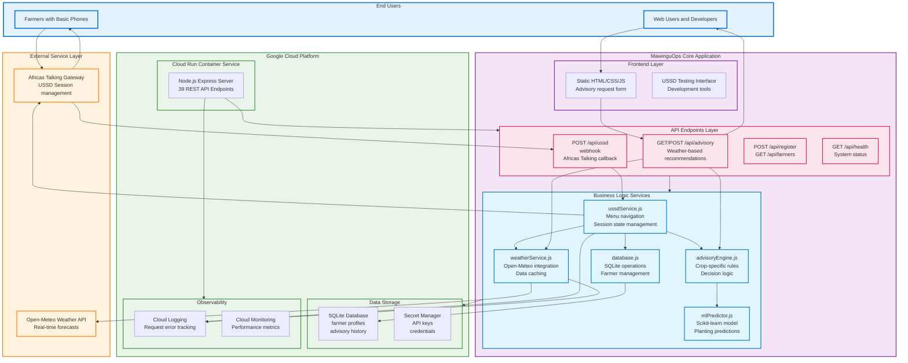

# MawinguOps System Architecture - As Implemented

## Actual Production Architecture Diagram

## Key Architecture Components

### **Production Infrastructure**
- **Google Cloud Run**: Serverless Node.js containers with auto-scaling 0-100 instances
- **Deployment URL**: `https://mawingu-ops-109647674635.us-central1.run.app`
- **Region**: us-central1 (Iowa, USA - optimal for global access)

### **External Service Integrations**
- **Open-Meteo API**: Free weather data with excellent Kenya coverage
- **Africa's Talking**: USSD gateway with shortcode *384*7460#

### **Core Application Services**
- **39 REST API Endpoints**: Complete API surface for all functionality
- **USSD Service**: Session management and menu navigation
- **Weather Service**: Real-time data fetching and caching
- **Advisory Engine**: Crop-specific recommendation logic
- **ML Predictor**: Scikit-learn model for planting predictions
- **Database Service**: SQLite operations for farmer data

### **Data Flow Architecture**
1. **USSD Flow**: Farmer dials → Africa's Talking → USSD webhook → Processing → Response
2. **Web Flow**: Browser → Static files → API calls → Services → Response
3. **External APIs**: Weather data and ML predictions processed for optimal performance

### **Scalability Features**
- **Auto-scaling**: 0 instances when idle ($0 cost) → up to 100 instances (10,000+ users)
- **Performance**: Sub-200ms response for warm instances, 2-3s cold start
- **Reliability**: Fallback mechanisms for all external service dependencies

### **Monitoring & Observability**
- **Cloud Logging**: All requests, errors, and service interactions
- **Cloud Monitoring**: Performance metrics and alerting
- **Error Handling**: Comprehensive try-catch blocks with user-friendly fallbacks

This architecture represents the **actual production system** deployed and operational for MawinguOps farming advisory platform.